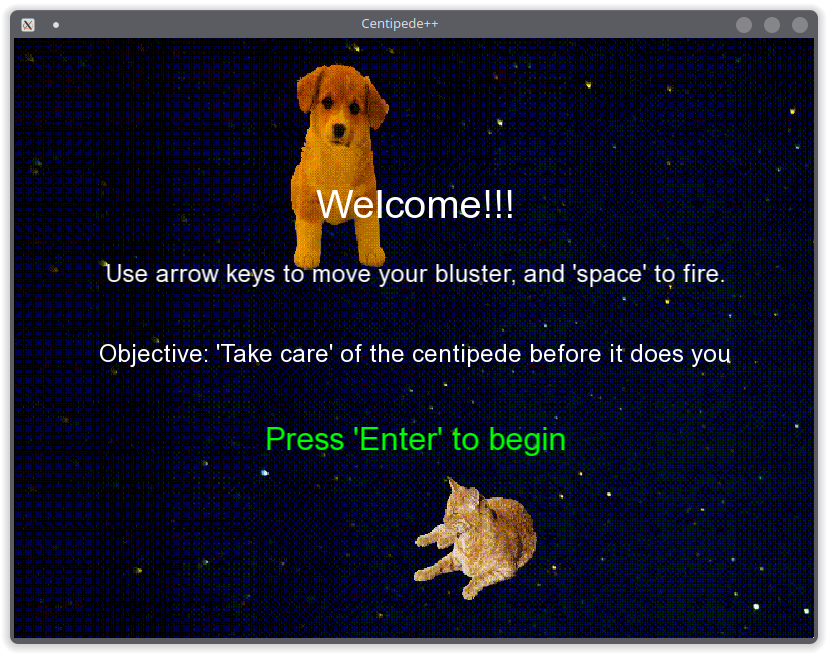
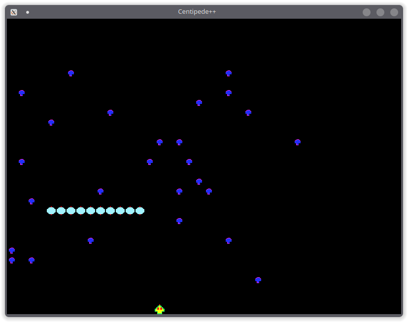

# Centipede++

Welcome to the Centipede Game project! This classic game is implemented using C++ and the SFML library. In this game, you control a blaster and aim to defeat the centipede while avoiding mushrooms and other obstacles.

## Getting Started

To run the game, clone the repo, navigate to the game-source-code directory, where there'll a unix binary, and execute it. 

On unix based system, you can use the snippet below. 
```bash
git clone https://github.com/NduvhoEdward/CPP_Centipede 
cd CPP_Centipede/src/game-source-code 
./Centipede++ 
```

If you make any changes to the code, you'll need to re-compile it. Use the provided bash script (`build.sh`) to compile the source code. Make sure you have the SFML library installed on your system.

```bash
# Compile the project 
cd CPP_Centipede/src/game-source-code 
./build.sh
```

If compilation is successful, you can run the game by executing the generated executable:

```bash
# Run the game
./Centipede++
```

## Gameplay

- Control the blaster to defeat the centipede.
- Avoid mushrooms and other obstacles.
- Try to achieve the highest score by eliminating the centipede segments.

## Source Files

The project consists of the following source files:

- `main.cpp`: The main entry point of the game.
- `Blaster.cpp`: Implementation of the blaster class.
- `Centipede.cpp`: Implementation of the centipede class.
- `Game.cpp`: Game logic and main loop.
- `Mushrooms.cpp`: Implementation of the mushrooms class.
- `Player.cpp`: Implementation of the player class.

## Compilation

The provided `build.sh` script compiles the project using the following compiler options:

- C++ standard: C++20
- Optimization level: O2

## Dependencies

The project depends on the SFML library, specifically the following components:

- `sfml-graphics`
- `sfml-window`
- `sfml-system`

Ensure that you have SFML installed on your system to compile and run the game.

## Acknowledgments

This Centipede Game project is created as part of a learning journey for Electrical and Information Engineering undergraduates and showcases skills in C++ game development. 
Special thanks to my development partner [Claire Stewart](https://github.com/Claire-Stewart1) for her great and valuable contribution to the development of this little vintage game.

Have fun!



